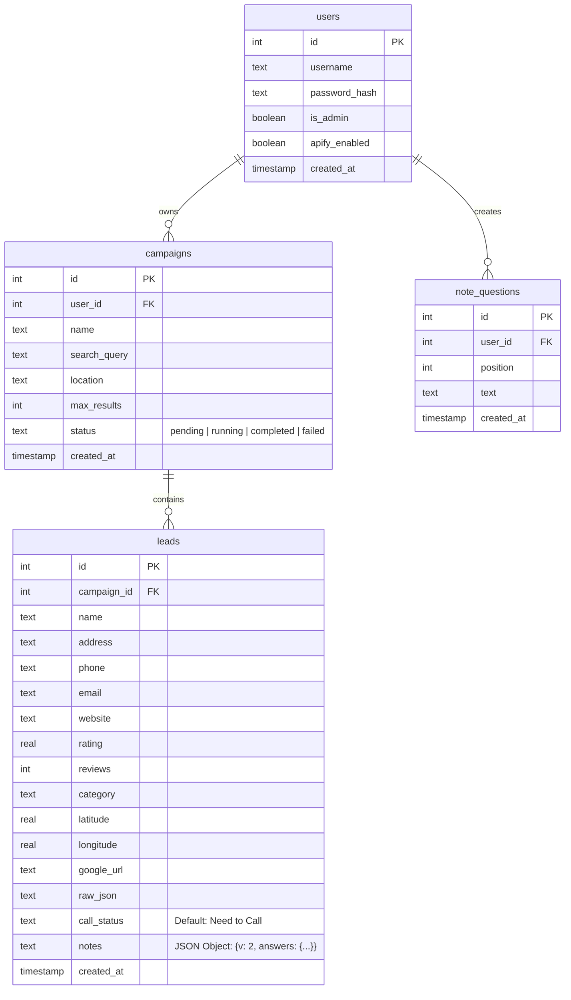

# Gemini.md - Project Context & Developer Reference

This document provides a comprehensive overview of the **RestrucAI Client Acquisition / Google Maps Lead Generator** application. Use this guide to quickly understand the architecture, database schema, workflow state, key frontend/backend systems, and notable implementation fixes.

---

## ── 1. Application Overview ──────────────────────────────────────────

The RestrucAI Client Acquisition app is a self-contained, single-user B2B outreach and lead generation tool. It enables users to:
1. Turn plain-English criteria (e.g., *"Find 15 dentists in Seattle"*) into targeted lead generation campaigns.
2. Scrape business locations, reviews, phone numbers, ratings, and websites using **Apify's Google Maps Scraper**.
3. Persist leads in a secure, real-time **Supabase (PostgreSQL)** database.
4. Crawl business homepages and contact links in background threads to enrich profiles with direct emails.
5. Answer tailored notes/questionnaires per lead to compile personalized sales context.
6. Generate highly-tailored, structure-preserving outreach emails with **Anthropic Claude 4.6 Sonnet** (via **OpenRouter**).
7. Trigger instant email delivery through an **n8n webhook workflow**.

---

## ── 2. Technical Stack ────────────────────────────────────────────────

### Backend (Python / Flask)
* **Core Web Server**: Flask running in debug mode on `http://127.0.0.1:5000`.
* **State & Multi-threading**: Real-time progress tracker and scrapers run on background daemon threads.
* **Integrations**:
  * `supabase-py`: Cloud database access and replication queries.
  * `apify-client`: Google Place Scraper API integration.
  * `openai` (configured to use OpenRouter base URL): Generates AI email drafts.
  * `requests`: Queries external scrapers and trigger webhooks.

### Frontend (Vanilla JS & Modern CSS)
* **Visuals**: Modern dark-mode palette, glowing gradients, clean UI fonts (`Plus Jakarta Sans`), monospaced code blocks (`DM Mono`), and Lucide icons.
* **Framework**: Zero frameworks or bundlers. Fully written in Vanilla JS (`app.js` and `ui.js`).
* **Real-time Updates**: Subscribes to Supabase Realtime replication channels (`postgres_changes` on the `leads` table) to refresh statuses, notes, and emails dynamically without full page reloads.

---

## ── 3. Directory & File Reference ───────────────────────────────────

* [app.py](file:///D:/codex/restrucai-client-acquisition/app.py): Entry point. Exposes campaign management APIs, authentication routes, notes/status patchers, and triggers the n8n email-sending payload.
* [db.py](file:///D:/codex/restrucai-client-acquisition/db.py): High-level client wrapper for Supabase database CRUD operations.
* [email_prompts.py](file:///D:/codex/restrucai-client-acquisition/email_prompts.py): System and user prompt configuration templates for the OpenRouter drafting agent.
* [email_enricher.py](file:///D:/codex/restrucai-client-acquisition/email_enricher.py): Web crawler that fetches a lead's homepage and checks subpages (e.g., `/contact`, `/about`) to pull direct `mailto:` links and regex-matched emails.
* [apify_service.py](file:///D:/codex/restrucai-client-acquisition/apify_service.py): Communicates with Apify Actor `compass~google-places-scraper` to fetch raw lead details.
* [query_builder.py](file:///D:/codex/restrucai-client-acquisition/query_builder.py): Standardizes unstructured user requirements into `search_query`, `location`, and `max_results` keys using OpenRouter or heuristic regex fallbacks.
* [supabase_schema.sql](file:///D:/codex/restrucai-client-acquisition/supabase_schema.sql): Relational database structure for campaigning and lead tracking.
* [templates/index.html](file:///D:/codex/restrucai-client-acquisition/templates/index.html): Multi-panel dashboard, custom question layouts, and the email editor drawer.
* [static/js/app.js](file:///D:/codex/restrucai-client-acquisition/static/js/app.js): Application lifecycle, campaign/leads state, websocket real-time listeners, and modal rendering logic.
* [static/css/style.css](file:///D:/codex/restrucai-client-acquisition/static/css/style.css): Custom variables, glassmorphic card overlays, side-by-side modal rendering, and layout rules.

---

## ── 4. Database Schema (Supabase PostgreSQL) ─────────────────────────



---

## ── 5. Status Workflow & AI Email Drafting ────────────────────────

### Lead Call Status Options
The available statuses for any lead in the pipeline are:
`'Need to Call'` | `'Called NIL'` | `'Not Answered'` | `'Interested'` | `'Follow-Up'` | `'Email'` | `'Closed'` | `'No Data'`

### Draft-Enabled Statuses
Only leads with the following qualified statuses can open and use the AI email draft side panel:
1. **`'Interested'`**: Drafts a highly personalized, warm B2B **Fresh Outreach / First-Touch** pitch email.
2. **`'Email'`**: Also drafts a high-converting, personalized B2B **Fresh Outreach / First-Touch** pitch email (shares the identical first-touch instruction set as *Interested*).
3. **`'Follow-Up'`**: Drafts a supportive, friendly **Follow-up** referencing previous context/interaction details.

*Note: All email drafts are styled to naturally incorporate answers from the customized Q&A questionnaire and free-form notes as tailored, hand-crafted observations.*

---

## ── 6. Crucial Frontend Implementation Fixes ────────────────────────

### 1. Robust Click-Outside (Prevention of Accidental Closures)
In the past, the modal overlays could close instantly when a user selected text inside a textarea/input but released the mouse cursor outside the panel border. 
* **The Solution**: 
  * The inline `onclick` handler was removed from `notes-modal-overlay` in [index.html](file:///D:/codex/restrucai-client-acquisition/templates/index.html).
  * A robust pointer listener is bound in [app.js](file:///D:/codex/restrucai-client-acquisition/static/js/app.js) inside `init()`:
    ```js
    const overlay = document.getElementById('notes-modal-overlay');
    if (overlay) {
        let mouseDownTarget = null;
        overlay.addEventListener('mousedown', (e) => {
            mouseDownTarget = e.target;
        });
        overlay.addEventListener('click', (e) => {
            // Only trigger close if both the mousedown AND mouseup (click) started and finished directly on the backdrop itself
            if (e.target === overlay && mouseDownTarget === overlay) {
                this.closeNotesModal();
            }
        });
    }
    ```
  * Clicks inside `.notes-modal` and `#draft-panel` still call `event.stopPropagation()`, ensuring absolutely no accidental data-loss during selections or copy-pasting.

### 2. Clipboard Layout Preservation in Email Editor
Text pasted into the email draft editor was previously losing its original newlines, spacing, or paragraph layouts.
* **The Solution**: 
  * In [style.css](file:///D:/codex/restrucai-client-acquisition/static/css/style.css), the `.draft-textarea` style is explicitly updated to:
    ```css
    .draft-textarea {
        flex: 1 1 auto;
        min-height: 220px;
        resize: vertical;
        line-height: 1.5;
        font-family: var(--font-mono); /* Monospace preserves whitespace alignment perfectly */
        white-space: pre-wrap;        /* Visually renders pasted and AI-generated newlines/tabs exactly */
        word-wrap: break-word;        /* Respects boundary constraints elegantly */
    }
    ```

---

## ── 7. Environment Setup & Execution Reference ─────────────────────

Ensure the `.env` file exists in the root of the project with the following keys:
```env
APIFY_API_TOKEN=your_apify_token_here
OPENROUTER_API_KEY=your_openrouter_api_key_here
SUPABASE_URL=your_supabase_project_url_here
SUPABASE_KEY=your_supabase_anon_key_here
TELEGRAM_BOT_TOKEN=optional_bot_token_for_notifications
TELEGRAM_CHAT_ID=optional_chat_id_for_notifications
N8N_SEND_URL=your_n8n_email_sending_webhook_url
```

### Dev Commands
```bash
# 1. Setup python virtual environment
python -m venv venv
.\venv\Scripts\activate  # Windows Powershell

# 2. Install dependencies
pip install -r requirements.txt

# 3. Launch Flask server local debug mode (port 5000)
python app.py
```
